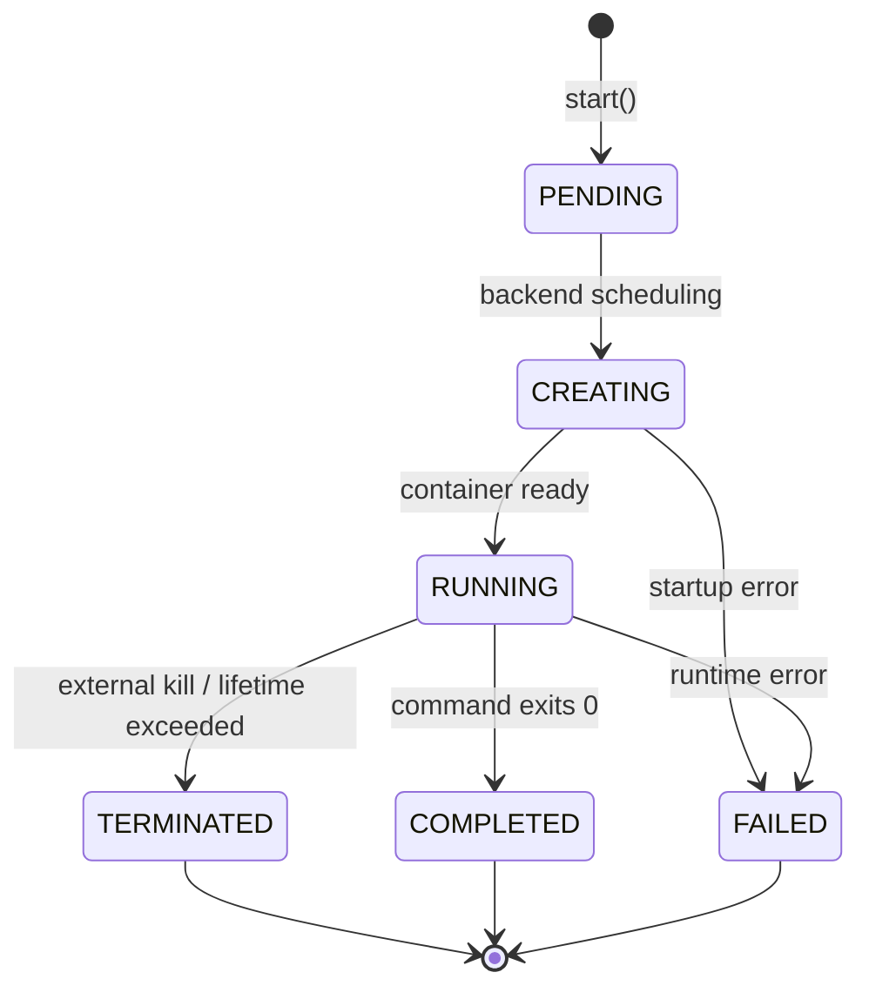

# Sandbox lifecycle guide

Covers sandbox states, creation patterns, waiting, and shutdown behavior.

## Lifecycle states

Every sandbox passes through a series of states. The SDK represents these as `SandboxStatus` values.



| State | Meaning | Terminal? | How `wait()` handles it |
|-------|---------|-----------|------------------------|
| `PENDING` | Start accepted, waiting for backend scheduling | No | Polls through |
| `CREATING` | Backend is provisioning the container | No | Polls through |
| `RUNNING` | Container is up and accepting operations | No | Returns normally |
| `COMPLETED` | Command exited with code 0 | Yes | Returns normally |
| `TERMINATED` | Externally killed or `max_lifetime_seconds` exceeded | Yes | Raises `SandboxTerminatedError` |
| `FAILED` | Startup or runtime error | Yes | Raises `SandboxFailedError` |
| `UNSPECIFIED` | Backend no longer tracking this sandbox | Yes | Treated as completed, returns normally |

`PENDING` and `CREATING` are transient - the SDK polls through them automatically.
`RUNNING` is the stable operational state. `COMPLETED`, `TERMINATED`, `FAILED`, and `UNSPECIFIED`
are terminal.

## Creation patterns

There are two ways to create a sandbox, differing in when the start RPC fires.

### Sandbox.run() - immediate start

`Sandbox.run()` creates a sandbox and calls `start().result()` internally, blocking until the
backend accepts the request:

```python
from aviato import Sandbox

# Returns after backend accepts the start request
sandbox = Sandbox.run("echo", "hello")

# sandbox_id is set immediately
print(sandbox.sandbox_id)  # "sandbox-abc123"

# But status may still be PENDING - not necessarily RUNNING yet
```

The first positional argument is the command, the rest are arguments:

```python
# These are equivalent
Sandbox.run("echo", "hello", "world")
Sandbox.run(command="echo", args=["hello", "world"])
```

### session.sandbox() - deferred start

`session.sandbox()` creates a sandbox object without making any network call. The start RPC
fires on first use:

```python
import aviato
from aviato import SandboxDefaults

with aviato.Session(SandboxDefaults()) as session:
    sandbox = session.sandbox(command="sleep", args=["infinity"])

    # No network call yet - sandbox_id is None
    print(sandbox.sandbox_id)  # None

    # First operation triggers start automatically
    result = sandbox.exec(["echo", "hello"]).result()
```

### Main command lifetime

The command passed to `run()` or `session.sandbox()` is the sandbox's main process. When it
exits, the sandbox transitions to `COMPLETED`:

```python
# This sandbox completes almost immediately - echo exits right away
sandbox = Sandbox.run("echo", "hi")
sandbox.wait()  # May already be COMPLETED

# For exec-based workflows, use a long-running main command
sandbox = Sandbox.run("sleep", "infinity")
# Or rely on the default (tail -f /dev/null)
sandbox = Sandbox.run()
```

If you need to run a short command and capture its output, use `exec()` on a long-running
sandbox rather than making the short command the main process.

## Starting

### Explicit start

`start()` sends the start RPC and returns an `OperationRef[None]`:

```python
sandbox = session.sandbox(command="sleep", args=["infinity"])

# Explicit start for error control
sandbox.start().result()  # Blocks until backend accepts
print(sandbox.sandbox_id)  # Now set
```

This is useful when you want to control timing or handle start errors separately from
operation errors.

### Auto-start

Most operations auto-start the sandbox if it hasn't been started yet. This makes the common
case simple: create a sandbox, start using it.

| Method | Auto-starts? | Notes |
|--------|-------------|-------|
| `exec()` | Yes | Also waits for RUNNING before executing |
| `read_file()` | Yes | Also waits for RUNNING before reading |
| `write_file()` | Yes | Also waits for RUNNING before writing |
| `wait()` | Yes | Starts, then polls until RUNNING or terminal |
| `wait_until_complete()` | Yes | Starts, then polls until terminal |
| `await sandbox` | Yes | Starts and waits for RUNNING |
| `get_status()` | No | Requires sandbox_id - call `start()` first |
| `stop()` | No | Nothing to stop if not started |

### Context managers and start

Context managers (`with`/`async with`) call `start()` on entry but do **not** call `wait()`.
If you need the sandbox to be RUNNING before your first operation, call `wait()` explicitly:

```python
with Sandbox.run("sleep", "infinity") as sandbox:
    # start() has been called, but sandbox may still be PENDING/CREATING
    sandbox.wait()  # Now guaranteed RUNNING (or raises on failure)
    result = sandbox.exec(["echo", "ready"]).result()
```

In practice, this rarely matters because `exec()` waits for RUNNING internally. Explicit
`wait()` is useful when you want to separate startup failures from operation failures.

## Waiting

### wait() - block until RUNNING

`wait()` polls until the sandbox reaches RUNNING or a terminal state:

```python
sandbox = Sandbox.run("sleep", "infinity")
sandbox.wait()  # Blocks until RUNNING

# Check status - could be RUNNING or a terminal state like COMPLETED
if sandbox.status == SandboxStatus.RUNNING:
    result = sandbox.exec(["echo", "hello"]).result()
```

The polling uses exponential backoff: starting at 0.2s intervals, scaling by 1.5x, capping
at 2.0s.

`wait()` returns self for method chaining:

```python
result = Sandbox.run("sleep", "infinity").wait().exec(["echo", "hello"]).result()
```

If the sandbox reaches a terminal state during startup, `wait()` handles it:

| Terminal state | wait() behavior |
|---------------|-----------------|
| `COMPLETED` | Returns normally (sandbox finished before RUNNING) |
| `UNSPECIFIED` | Returns normally (treated as completed) |
| `FAILED` | Raises `SandboxFailedError` |
| `TERMINATED` | Raises `SandboxTerminatedError` |

### wait_until_complete() - block until terminal

`wait_until_complete()` blocks until the sandbox reaches any terminal state. Use this for
sandboxes where the main command does the work:

```python
sandbox = Sandbox.run("python", "train.py")
sandbox.wait_until_complete(timeout=3600.0)
print(sandbox.returncode)  # 0 if training succeeded
```

The `raise_on_termination` parameter controls behavior when a sandbox is externally terminated:

```python
from aviato import SandboxTerminatedError

# Default: raises on termination
try:
    sandbox.wait_until_complete()
except SandboxTerminatedError:
    print("Sandbox was killed externally")

# Suppress termination errors for graceful handling
sandbox.wait_until_complete(raise_on_termination=False)
if sandbox.status == SandboxStatus.TERMINATED:
    print("Terminated, but we handle it ourselves")
```

### Timeout phases

Startup wait time and operation timeouts are separate phases:

```
start() ──> [startup wait] ──> RUNNING ──> exec() ──> [operation timeout]
```

- **Startup wait**: Time spent in PENDING/CREATING before reaching RUNNING. Controlled by the
  `timeout` parameter on `wait()` or `wait_until_complete()`. Typically 30-60 seconds depending
  on backend scheduling.
- **Operation timeout**: Time for an individual exec/read/write. Controlled by `timeout_seconds`
  on `exec()`, or `request_timeout_seconds` in `SandboxDefaults`. Does not include startup wait.

## Operations and lifecycle

Operations like `exec()`, `read_file()`, and `write_file()` auto-start the sandbox if needed,
then wait for RUNNING before proceeding:

```python
# Session sandbox - not started yet
sandbox = session.sandbox()

# exec() handles everything: start -> wait for RUNNING -> execute command
result = sandbox.exec(["echo", "hello"]).result()
```

The operation timeout (`timeout_seconds`) applies only after the sandbox is RUNNING. Startup
time is not counted against it.

## Stopping and end of life

### stop()

`stop()` sends a stop request and returns `OperationRef[None]`:

```python
sandbox.stop().result()  # Blocks until stopped
```

Parameters:

| Parameter | Default | Purpose |
|-----------|---------|---------|
| `graceful_shutdown_seconds` | 10.0 | Grace period for processes to exit before force-kill |
| `snapshot_on_stop` | `False` | Capture sandbox filesystem state before shutdown |
| `missing_ok` | `False` | Return normally if sandbox already gone (instead of raising) |

```python
# Capture state for debugging
sandbox.stop(snapshot_on_stop=True).result()

# Idempotent cleanup - safe to call even if sandbox is already gone
sandbox.stop(missing_ok=True).result()

# Give processes more time to shut down
sandbox.stop(graceful_shutdown_seconds=30.0).result()
```

`stop()` handles in-flight starts: if a start is still being processed, it waits for start to
complete before stopping. Multiple calls to `stop()` are safe - the second call returns
immediately.

### Post-stop behavior

After stopping, the sandbox is unusable. Further operations raise `SandboxNotRunningError`:

```python
sandbox.stop().result()

# These will raise SandboxNotRunningError
sandbox.exec(["echo", "hello"])  # Raises
sandbox.read_file("/path")       # Raises
```

The `status` property is cached from the last API call. For fresh data before stopping, use
`get_status()`:

```python
fresh_status = sandbox.get_status()
if fresh_status == SandboxStatus.RUNNING:
    sandbox.stop().result()
```

### Context manager exit

Context managers call `stop()` automatically on exit:

```python
with Sandbox.run("sleep", "infinity") as sandbox:
    result = sandbox.exec(["echo", "hello"]).result()
# stop() called here, even if an exception occurred inside the block
```

If an exception is in-flight, the context manager suppresses stop errors to avoid masking the
original exception.

### stop() vs delete()

| | `stop()` | `delete()` |
|-|----------|-----------|
| Target | Live sandbox instance | Sandbox by ID (class method) |
| Purpose | Graceful shutdown | Permanent removal / orphan cleanup |
| Requires instance? | Yes | No - `Sandbox.delete(sandbox_id)` |
| `missing_ok` | Yes | Yes |

Use `stop()` for sandboxes you're actively using. Use `delete()` for cleanup of sandboxes
discovered via `Sandbox.list()` or `Sandbox.from_id()`:

```python
# Stop a sandbox you created
sandbox.stop().result()

# Delete an orphan by ID
Sandbox.delete("sandbox-abc123", missing_ok=True).result()
```

See the [Cleanup Patterns Guide](cleanup-patterns.md) for orphan management and batch cleanup
strategies.

## Under the hood

The SDK runs all gRPC operations on a background daemon thread with its own asyncio event loop.
This design means:

- The sync API (`.result()`) blocks the calling thread while the background loop handles the
  network call.
- The async API (`await`) bridges to the same background loop, so both patterns use the same
  underlying implementation.
- The background loop starts lazily on first use. gRPC channels are also created lazily.
- Auto-start works by checking if `sandbox_id` is None before each operation and triggering
  `start()` if so.
- On process exit, cleanup handlers (atexit + signal handlers) stop all sandboxes in registered
  sessions. A second Ctrl+C during cleanup forces immediate exit.

This architecture avoids cross-event-loop issues and works in Jupyter notebooks without
`nest_asyncio`. See the [Sync vs Async Guide](sync-vs-async.md) for usage patterns.

## Common patterns

### Quick one-off

Run a command and get the result. Context manager handles cleanup:

```python
from aviato import Sandbox

with Sandbox.run() as sandbox:
    result = sandbox.exec(["echo", "hello"]).result()
    print(result.stdout)
```

### Controlled startup

Separate start errors from operation errors:

```python
from aviato import Sandbox, SandboxFailedError

sandbox = Sandbox.run("sleep", "infinity")
try:
    sandbox.wait()
except SandboxFailedError:
    print("Failed to start - check container image and resources")
    raise

result = sandbox.exec(["echo", "ready"]).result()
sandbox.stop().result()
```

### Long-running sandbox

Wait for the main command to complete:

```python
from aviato import Sandbox

sandbox = Sandbox.run("python", "train.py")
sandbox.wait_until_complete(timeout=7200.0)

if sandbox.returncode == 0:
    data = sandbox.read_file("/output/model.pt").result()
```

### Reconnection

Reattach to a sandbox from a previous session or process:

```python
from aviato import Sandbox, SandboxStatus

sandbox = Sandbox.from_id("sandbox-abc123").result()

# from_id() fetches current status but does not start or verify the sandbox
if sandbox.status == SandboxStatus.RUNNING:
    result = sandbox.exec(["echo", "reconnected"]).result()
else:
    print(f"Sandbox is {sandbox.status}, not RUNNING")
```

### Parallel batch with session

Create multiple sandboxes and wait for results:

```python
import aviato
from aviato import SandboxDefaults

with aviato.Session(SandboxDefaults(tags=("batch-job",))) as session:
    sandboxes = [session.sandbox() for _ in range(5)]

    processes = [
        sb.exec(["python", "-c", f"print({i} ** 2)"])
        for i, sb in enumerate(sandboxes)
    ]

    done, pending = aviato.wait(processes)
    for p in done:
        print(p.result().stdout)
```

## See also

- [Sync vs Async Guide](sync-vs-async.md) - when to use `.result()` vs `await`
- [Sessions Guide](sessions.md) - managing multiple sandboxes with shared configuration
- [Cleanup Patterns Guide](cleanup-patterns.md) - orphan management and resource cleanup
- [Troubleshooting Guide](troubleshooting.md) - common errors and solutions
